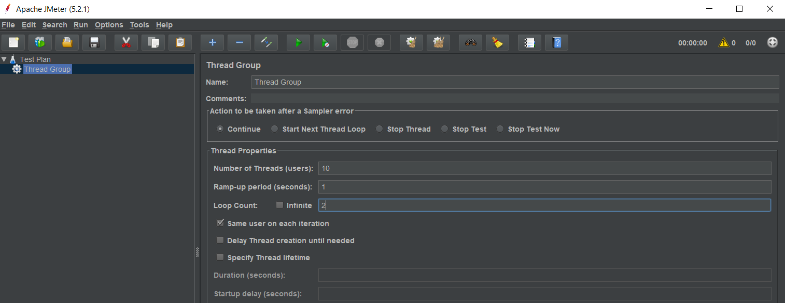
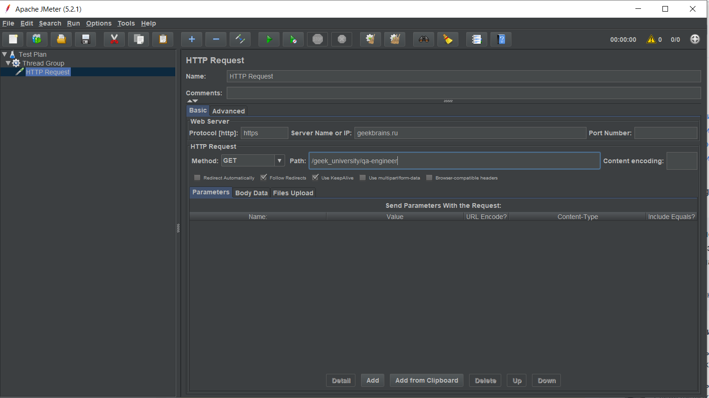
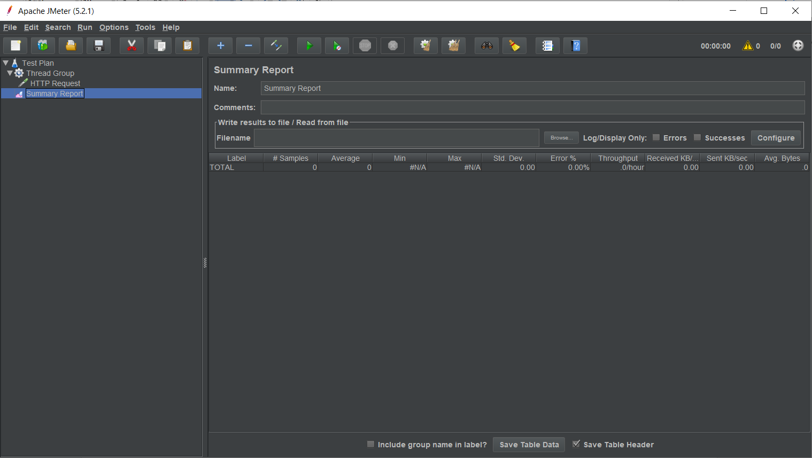
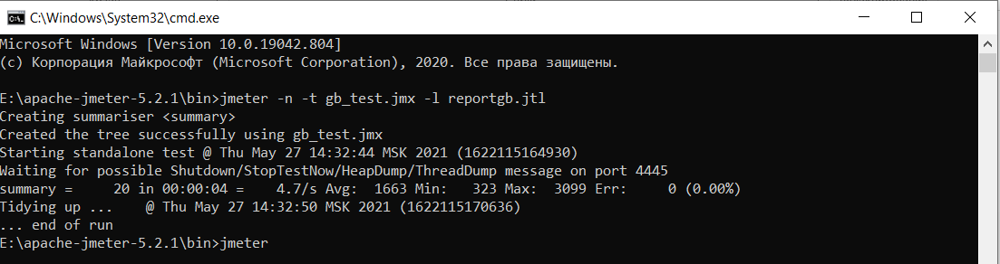
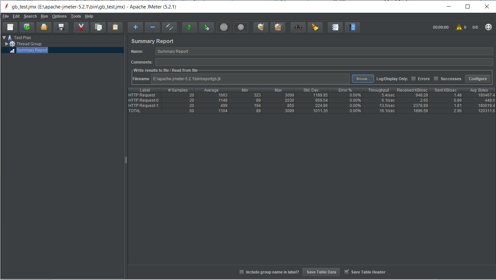

# Провела нагрузочное тестирование сайта с помощью Apache JMeter.

**Настроила тест-план, задала количество потоков и повторов.**

**Добавила Summary Report.**

**Провела тестирование. Запуск через консоль.**

**Проанализировала результаты (поля Summary Report).**

* Samples. По 20 запросов. Общее количество 60 запросов.
* Average - среднее время ответа от 0,5 до 1,6 секунды для http запросов, среднее время по всем запросам 1,1 секунды.
* Min - минимальное время ответа 0,08 секунды из всех http запросов.
* Max - максимальное время ответа 3 секунды из всех http запросов.
* Throughput – количество запросов в секунду 16.1 по всем запросам.
* Std Dev – показатель стандартного отклонения =1011,35 по всем запросам.
* Error % - 0,00%. Ошибок нет.
* Received KB/sec – средняя скорость получения данных 1896,56 килобайт в секунду по всем запросам.
* Sent KB/sec - средняя скорость отправки данных 2,96 килобайт в секунду по всем запросам.
* Avg.Bytes — среднее количество полученных данных 120311,6 байт по всем запросам.
